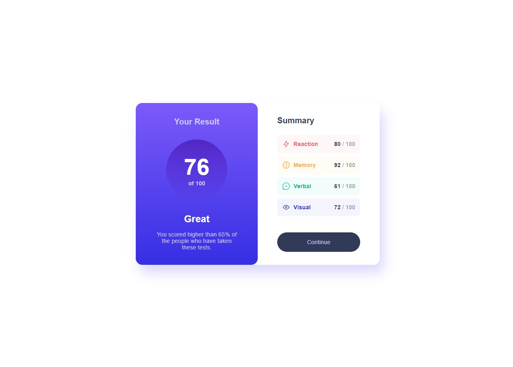

# Frontend Mentor - Results summary component

## Overview

### Screenshot

## My process

### Built with

- Semantic HTML5 markup
- CSS custom properties
- Flexbox
- Sass

## Author

- Website - [https://roraima1986.github.io/resultssummary.github.io/](https://roraima1986.github.io/resultssummary.github.io/)
